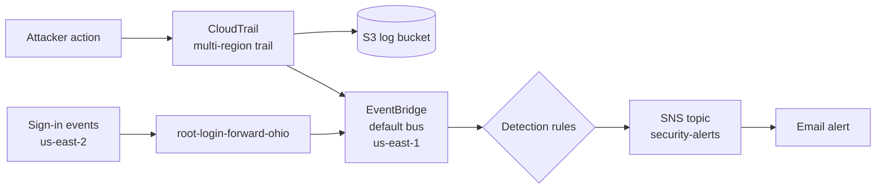
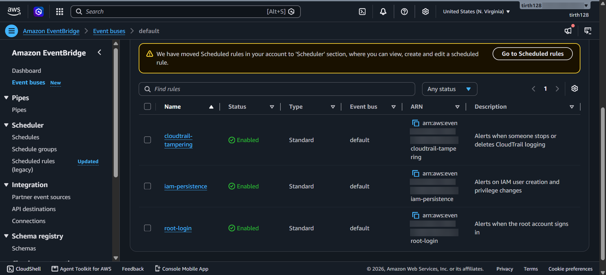
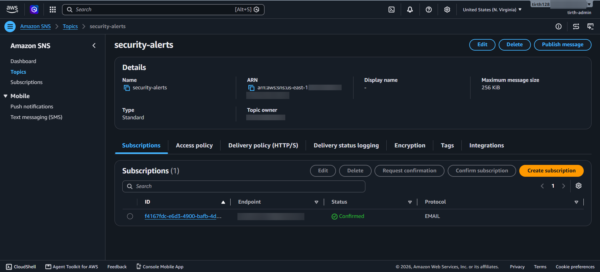
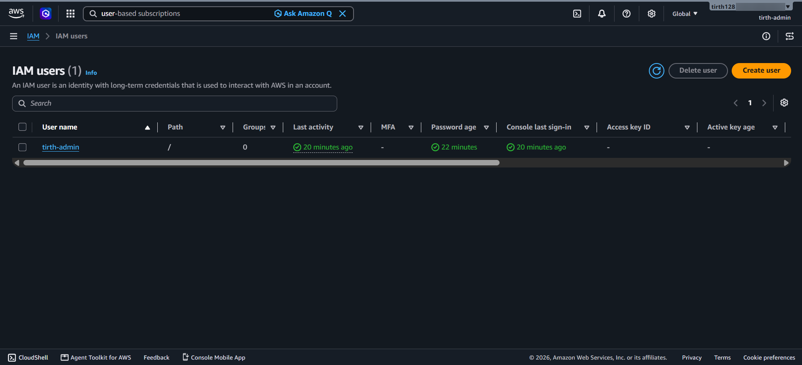
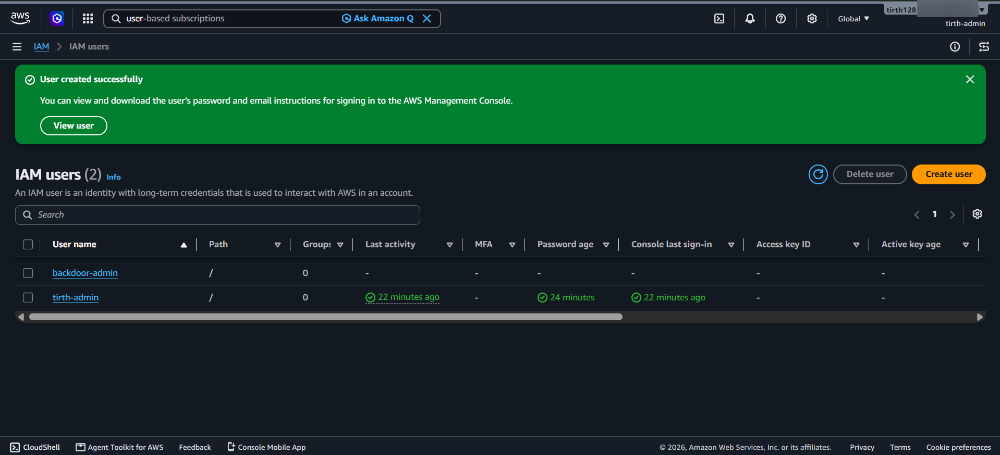
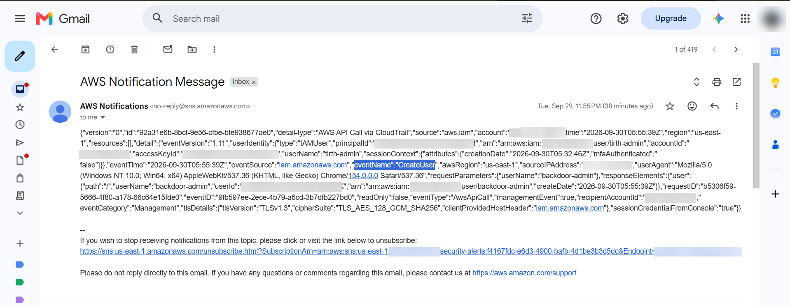
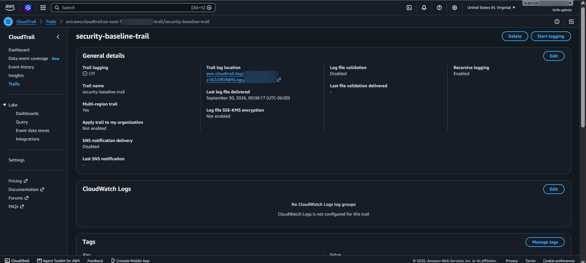
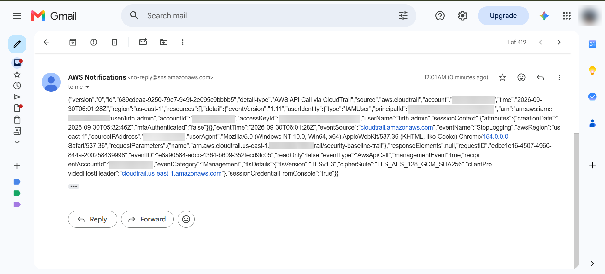
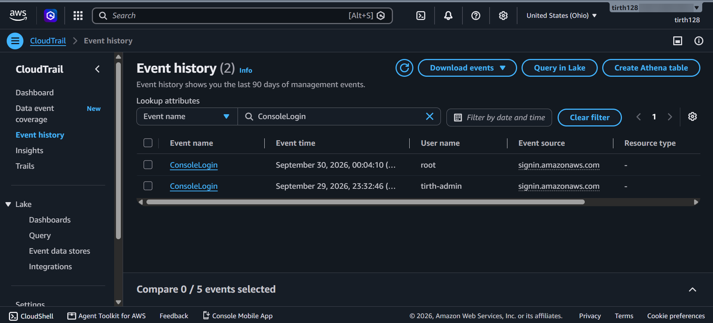
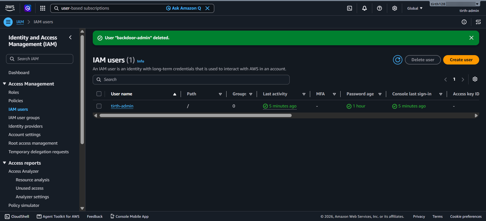

# AWS CloudTrail Security Monitoring: Detecting Suspicious IAM Activity

I built a real-time alerting setup in my own AWS account that emails me when someone does something an attacker would do, like creating a backdoor admin user or turning off logging. Then I attacked my own account to see if it actually works.

**Result:** 4 out of 5 of my simulated attacks triggered an alert within seconds. The 5th one (a root login) didn't, and figuring out why ended up being the most useful part of the whole project.

---

## Why I Built This

I'm a second-year Computer Science student at the University of Regina, and I want to get into blue team and cloud security. I kept reading about the same kind of breach: someone accidentally pushes their AWS keys to GitHub, bots find them within minutes, and the attacker quietly makes a backdoor admin account and turns off logging. A lot of the time nobody notices for weeks.

So I asked myself a simple question: **if this happened to my AWS account, would I even know?**

To find out, I built the alerts first and then played the attacker. I pretended to be "Tony," someone who stole my admin credentials, and did everything from that playbook. After that I switched sides and investigated like I was working in a SOC.

---

## How It Works

The way I think about it:

- **CloudTrail** is the security camera. It records every action in the account.
- **S3** is where the recordings are stored.
- **EventBridge** is the guard watching the camera for specific things.
- **SNS** is the guard calling me (it sends the email).
- **IAM**: I set up a separate admin user and locked down the root account with MFA.

---

## What I Detect

| Rule | What it catches | Events | MITRE ATT&CK |
|---|---|---|---|
| `iam-persistence` | Someone creating a backdoor user or giving it admin rights | CreateUser, AttachUserPolicy, CreateAccessKey, PutUserPolicy | T1136.003, T1098, T1098.001 |
| `cloudtrail-tampering` | Someone trying to turn off or change logging | StopLogging, DeleteTrail, UpdateTrail | T1562.008 |
| `root-login` | Someone signing in as root | ConsoleLogin (Root) | T1078.004 |

The JSON for each rule is in [`eventbridge-rules/`](eventbridge-rules/).

---

## 🎬 The Story: Tirth vs. Tony

This is the whole attack, step by step, with screenshots from my account. Times are Regina time (CST). I blurred my account ID, email, IP and key IDs.

**At a glance:**

| # | What Tony did | Caught? |
|---|---|---|
| 1 | Created a user called `backdoor-admin` | ✅ Email in seconds |
| 2 | Gave it `AdministratorAccess` | ✅ Email in seconds |
| 3 | Created an access key for it | ✅ Email in seconds |
| 4 | Stopped CloudTrail to hide his tracks | ✅ Email in seconds |
| 5 | Signed in as root | ❌ Logged, but no email |

### Chapter 1: Setting up the guard 

Before anything happened, I set up my defenses. CloudTrail was recording everything, and I wrote 3 EventBridge rules to watch for attacker behaviour.

Then I connected the rules to an SNS topic so every match would land in my inbox. I had to click a confirmation link in my email before it would work.

### Chapter 2: A normal night 

This is my account before the attack. Just one user, my admin account `tirth-admin`. Everything looks normal.

### Chapter 3: Tony breaks in and builds a backdoor  (11:55 PM)

In my scenario, Tony found my leaked admin credentials. The first thing a smart attacker does is make sure he can get back in even if I change my password. So Tony created his own user called `backdoor-admin`, gave it full `AdministratorAccess`, and created an access key for it.

**My setup caught it.** Within seconds, my phone buzzed with an alert. The email shows exactly what happened: `"eventName":"CreateUser"`, who did it (`tirth-admin`), and that the session had **no MFA** (`"mfaAuthenticated":"false"`). Two more emails followed for AttachUserPolicy and CreateAccessKey.

### Chapter 4: Tony tries to hide  (12:01 AM)

Next, Tony turned off CloudTrail so nothing else he did would get recorded. Here's the trail with logging switched **Off**.

But here's the thing: **turning off logging is itself a logged action.** The `StopLogging` event got recorded right before the camera went dark, my `cloudtrail-tampering` rule matched it, and I got another alert. This was my favourite moment of the project.

### Chapter 5: Tony goes for root  (12:04 AM)

Finally, Tony signed in as the root user, the most powerful account there is. I waited for the alert... and nothing came.

So I put on my investigator hat. I searched CloudTrail Event History for `ConsoleLogin` in N. Virginia, where my rules live. No results. Then I checked other regions and found it in **Ohio (us-east-2)**:

The root login was recorded, just in a different region than the one my rule was watching. EventBridge rules only see events in their own region, so my alert never had a chance to fire.

### Chapter 6: Kicking Tony out 

Time to clean up. I turned CloudTrail logging back on, deleted Tony's access key, and deleted `backdoor-admin`. The account is back to just my admin user.

**Final score:** 4 out of 5 attacks caught within seconds. 1 gap found, investigated and documented.

The full timeline with exact UTC times is in my [incident report](incident-report.md).

---

## What Went Wrong (and What I Learned)

My root-login rule looked correct, but it never fired. Here's how I tracked it down:

1. I searched CloudTrail Event History for `ConsoleLogin` in us-east-1. Nothing.
2. I checked other regions and found the root login in **us-east-2 (Ohio)**. My own admin logins were there too.
3. That's when it clicked: sign-in events get logged in the region you sign in through, and EventBridge rules only see events in their own region.

To fix it, I made a rule in Ohio (`root-login-forward-ohio`) that forwards root logins to N. Virginia. The email still didn't show up, so this is still something I'm working on. My next steps:

- Check the Ohio rule's Monitoring tab to see if it matched the event or failed to forward it
- Make sure the forwarding role has permission to send events to the other region
- Try an SNS topic directly in Ohio instead of forwarding
- Eventually, deploy the rules to every region with CloudFormation StackSets

The big lesson for me: **don't assume a detection works just because the rule looks right. Test it.** If I hadn't simulated the attack, I would have thought root logins were covered.

---

## Other Things I Noticed

- **Every attacker event showed `"mfaAuthenticated": "false"`.** My admin user didn't have MFA, which is exactly the gap a real attacker would use. I've added MFA since.
- **Log file validation was off on my trail.** I missed it during setup and only noticed while reviewing. It should be on so you can prove the logs weren't changed.
- **Same user and same IP for every attack step.** In a real investigation, that pattern points to one stolen credential being used for the whole attack.

---

*Tirth Patel, Computer Science @ University of Regina*
