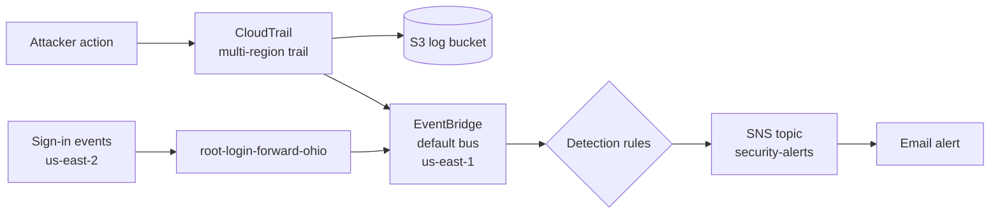

# AWS CloudTrail Security Monitoring: Detecting Suspicious IAM Activity

I built a real-time alerting setup in my own AWS account that emails me when someone does something an attacker would do, like creating a backdoor admin user or turning off logging. Then I attacked my own account to see if it actually works.

**Result:** 4 out of 5 of my simulated attacks triggered an alert within seconds. The 5th one (a root login) didn't, and figuring out why ended up being the most useful part of the whole project.

---

## Why I Built This

I'm a second-year Computer Science student at the University of Regina, and I want to get into blue team and cloud security. I kept reading about the same kind of breach: someone accidentally pushes their AWS keys to GitHub, bots find them within minutes, and the attacker quietly makes a backdoor admin account and turns off logging. A lot of the time nobody notices for weeks.

So I asked myself a simple question: **if this happened to my AWS account, would I even know?**

To find out, I built the alerts first and then played the attacker. I pretended to be "Tony," someone who stole my admin credentials, and did everything from that playbook. After that I switched sides and investigated the alerts like I was working in a SOC.

---

## How It Works

The way I think about it:

- **CloudTrail** is the security camera. It records every action in the account.
- **S3** is where the recordings are stored.
- **EventBridge** is the guard watching the camera for specific things.
- **SNS** is the guard calling me (it sends the email).
- **IAM**: I set up a separate admin user and locked down the root account with MFA.

---

## What I Detect

I wrote 3 rules, each one mapped to MITRE ATT&CK:

| Rule | What it catches | Events | MITRE ATT&CK |
|---|---|---|---|
| `iam-persistence` | Someone creating a backdoor user or giving it admin rights | CreateUser, AttachUserPolicy, CreateAccessKey, PutUserPolicy | T1136.003, T1098, T1098.001 |
| `cloudtrail-tampering` | Someone trying to turn off or change logging | StopLogging, DeleteTrail, UpdateTrail | T1562.008 |
| `root-login` | Someone signing in as root | ConsoleLogin (Root) | T1078.004 |

The JSON for each rule is in [`eventbridge-rules/`](eventbridge-rules/).

---

## The Attack

Here's what I did as "Tony" and whether my setup caught it:

| # | What I did | Caught? |
|---|---|---|
| 1 | Created a user called `backdoor-admin` | ✅ Email in seconds |
| 2 | Gave it `AdministratorAccess` | ✅ Email in seconds |
| 3 | Created an access key for it | ✅ Email in seconds |
| 4 | Stopped CloudTrail to hide my tracks | ✅ Email in seconds |
| 5 | Signed in as root | ❌ Logged, but no email |

The StopLogging one was my favourite. Turning off logging is itself a logged action, so the "camera" caught Tony right as he was switching it off.

I wrote up the full timeline and my investigation in [`incident-report.md`](incident-report.md).

---

## What Went Wrong (and What I Learned)

My root-login rule looked correct, but I never got an email. Here's how I tracked it down:

1. I searched CloudTrail Event History for `ConsoleLogin` in us-east-1 (N. Virginia). Nothing.
2. I started checking other regions and found the root login in **us-east-2 (Ohio)**. My own admin logins were there too.
3. That's when it clicked: sign-in events get logged in the region you sign in through, and EventBridge rules only see events in their own region. My rule was watching the wrong place.

To fix it, I made a rule in Ohio (`root-login-forward-ohio`) that forwards root logins over to N. Virginia. The email still didn't show up, so this is still something I'm working on. My next steps are:

- Check the Ohio rule's Monitoring tab to see if it matched the event or failed to forward it
- Make sure the forwarding role has permission to send events to the other region
- Try an SNS topic directly in Ohio instead of forwarding
- Eventually, deploy the rules to every region with CloudFormation StackSets

The big lesson for me: **don't assume a detection works just because the rule looks right. Test it.** If I hadn't simulated the attack, I would have thought root logins were covered.

---

## Other Things I Noticed

- **Every attacker event showed `"mfaAuthenticated": "false"`.** My admin user didn't have MFA, which is exactly the kind of gap a real attacker would use. I'm fixing that.
- **Log file validation was off on my trail.** I missed it during setup and only noticed while reviewing. It should be on so you can prove the logs weren't changed.
- **Same user and same IP for every attack step.** In a real investigation, that pattern points to one stolen credential being used for the whole attack.

---

## Screenshots

| File | What it shows |
|---|---|
| `01-iam-before.png` | Before the attack, only my admin user |
| `02-iam-backdoor-created.png` | Tony's backdoor account shows up |
| `03-alert-stoplogging.png` | The StopLogging alert email |
| `04-trail-logging-off.png` | The trail with logging turned off |
| `05-root-login-ohio.png` | Where I found the root login (Ohio) |
| `06-eventbridge-rules.png` | My 3 detection rules, all enabled |
| `07-sns-confirmed.png` | Email subscription confirmed |
| `08-alert-createuser.png` | The CreateUser alert email |
| `09-cleanup-done.png` | Backdoor deleted, back to normal |

I blurred my account ID, email, IP and key IDs in all of them.

---

## Tools and Cost

- **AWS:** CloudTrail, EventBridge, SNS, S3, IAM
- **Framework:** MITRE ATT&CK
- **Cost:** $0 (AWS Free plan)

---

*Tirth Patel, Computer Science @ University of Regina*
