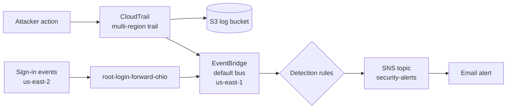

[README.md](https://github.com/user-attachments/files/32871956/README.md)
# AWS CloudTrail Security Monitoring: Detecting Suspicious IAM Activity

A real-time alerting pipeline in AWS that detects common attacker behaviour — creating backdoor accounts, escalating privileges, and disabling audit logs — and emails an alert within seconds. I tested it by simulating an attack on my own account and investigating the results like a SOC analyst.

**Result:** 4 of 5 simulated attacker actions were detected and alerted within seconds. The 5th (root login) led to a cross-region troubleshooting investigation, documented below.

---

## Architecture

| Service | Role in the pipeline |
|---|---|
| **CloudTrail** | Records every API call in the account (the "security camera") |
| **S3** | Stores the log files long-term |
| **EventBridge** | Matches events against detection rules (the "guard") |
| **SNS** | Sends the email alert (the "alarm") |
| **IAM** | Least-privilege admin user; root locked down with MFA |

---

## Detections

| Rule | Detects | Event names | MITRE ATT&CK |
|---|---|---|---|
| `iam-persistence` | Backdoor users and privilege escalation | CreateUser, AttachUserPolicy, CreateAccessKey, PutUserPolicy | T1136.003, T1098, T1098.001 |
| `cloudtrail-tampering` | Attempts to disable or alter logging | StopLogging, DeleteTrail, UpdateTrail | T1562.008 |
| `root-login` | Root account console sign-in | ConsoleLogin (type: Root) | T1078.004 |

Rule patterns are in [`eventbridge-rules/`](eventbridge-rules/).

---

## Attack Simulation

I played the attacker using a "compromised" admin identity, then switched roles to investigate.

| # | Attacker action | Detected? |
|---|---|---|
| 1 | Created user `backdoor-admin` | ✅ Alert in seconds |
| 2 | Attached `AdministratorAccess` to it | ✅ Alert in seconds |
| 3 | Created an access key for the backdoor | ✅ Alert in seconds |
| 4 | Stopped CloudTrail logging to hide activity | ✅ Alert in seconds |
| 5 | Signed in as root | ❌ Logged, but no alert (see Challenges) |

Full timeline and analysis: [`incident-report.md`](incident-report.md)

---

## Challenges & Troubleshooting

**Problem:** The root login never triggered an alert, even though the `root-login` rule was correct.

**Investigation:**
1. Searched CloudTrail Event History for `ConsoleLogin` in us-east-1 → **no results**.
2. Checked other regions → found the root login (and my admin logins) recorded in **us-east-2 (Ohio)**.
3. **Root cause:** Console sign-in events are recorded in the region of the sign-in endpoint, and EventBridge rules are regional. My rule was watching the wrong region.

**Fix attempted:** Created `root-login-forward-ohio` in us-east-2 to forward root sign-in events to the us-east-1 event bus. The alert still didn't arrive.

**Next steps:**
- Check the forwarding rule's Monitoring metrics (MatchedEvents / FailedInvocations) to find the broken link
- Verify the forwarding role has `events:PutEvents` on the us-east-1 bus
- Alternative: an SNS topic in us-east-2 targeted directly
- Long-term: deploy detection rules to every region with CloudFormation StackSets

**Lesson:** In AWS, "global" services don't always log globally. Detection coverage must be verified per region, not assumed.

---

## Lessons Learned

- **Test your detections.** The root-login rule looked correct but never fired. Only the simulation revealed the gap.
- **Attackers disable logging.** The StopLogging alert still fired, because the StopLogging call itself is recorded before logging stops.
- **MFA matters.** Every attacker event showed `"mfaAuthenticated": "false"`. Enforcing MFA would have raised the bar.
- **Log integrity.** Log file validation was found disabled during the review; it should be enabled to prove logs weren't altered.

---

## Screenshots

| File | Shows |
|---|---|
| `01-iam-before.png` | Clean state — one admin user |
| `02-iam-backdoor-created.png` | Attacker's backdoor account appears |
| `03-alert-stoplogging.png` | StopLogging alert email |
| `04-trail-logging-off.png` | Trail with logging disabled |
| `05-root-login-ohio.png` | Root login found in us-east-2 |
| `06-eventbridge-rules.png` | All 3 detection rules enabled |
| `07-sns-confirmed.png` | Email subscription confirmed |
| `08-alert-createuser.png` | CreateUser alert email |
| `09-cleanup-done.png` | Backdoor removed |

Account IDs, IPs, emails, and access key IDs are redacted.

---

## Tools & Cost

**AWS:** CloudTrail, EventBridge, SNS, S3, IAM
**Frameworks:** MITRE ATT&CK
**Cost:** $0 (AWS Free plan)

---

*Built by Tirth Patel — Computer Science, University of Regina*
